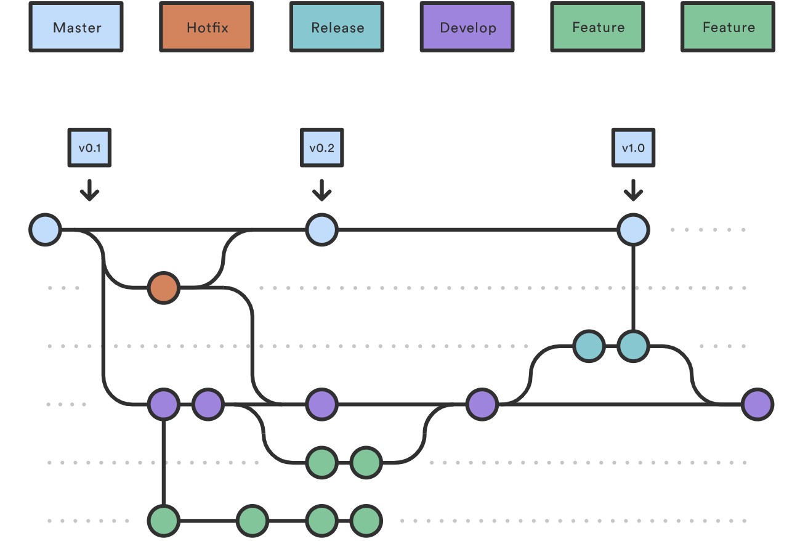
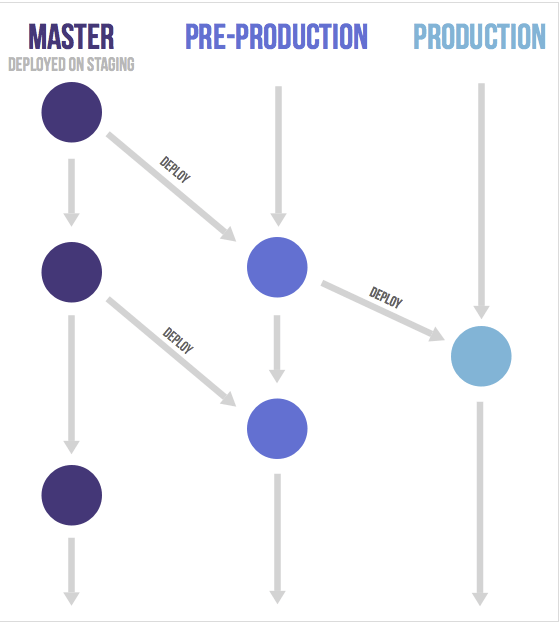

在团队中使用 git 来管理代码仓库已经是 common sense 了。

但具体的使用方式却又分好几种，我们先来看 3 种方式：

## git 工作流

git 流推荐使用两个长期存在的分支：master 和 develop，另外每个开发人员可以保留一些短期的 feature 分支（merge 后删除），修复分支和发布分支。

团队开发成员在准备开发时，从 develop 分支拉取新的分支进行开发，开发完成后，往 develop 进行合并。

产品准备发布时，从 develop 拉出一个新的发布分支，发布分支只允许合并 hotfix 分支的提交，等发布分支的功能经过验证后，合并到 master 分支进行主版本发布。

## GitHub 工作流

GitHub 流强调主分支的可持续部署，所有的功能开发都需要在 master 上拉出新的分支，需要保证分支名称需要有意义，能表达分支目的，

要求团队成员在开发过程中强调“小步提交”，每个提交需要提供详细的 Commit Message，这样可以追踪每个分支的开发进度。

在分支准备好合并的时候提交 Pull Request， 通常会有其他团队成员来 Review PR 和提出 comments，经过讨论后的 PR 可以合并到主分支。

## GitLab 工作流

GitLab 流相当于其他两种主流工作流的简化版，强调上游优先，指的是 master 分支优先合并，然后往 production 分支合并，所以在往 master 合并之前，保证测试的通过显得尤为重要。

在 feature 分支中，merge 方式使用快进合并（fast-farward），这样的好处是保持 mater 分支的提交历史是线性的。

另外，在 feature 分支中如果想要一些提交显得更有逻辑性，推荐使用 squash，即 git rebase --interactive 来合并一些提交，这样做还可以在远程分支有其他的提交的情况下，有效的减少本地的合并冲突工作。

## 如何选择

一般来讲 git 工作流能满足绝大部分需求，适合 15-25 人的团队协作，但这也引入了一些缺点。

对于 5 人或 5 人以下的小团队而言，git 工作流太过于复杂，GitHub 工作流又太过于细化和繁琐，可以选择流程简单同时又有一定伸缩性的 GitLab 工作流来进行日常的开发。

## git 常用指令

>使用 `git rebase` 合并代码：

先来看一下默认的合并方式： merge with no-ff

那什么是ff（fast-farward 快进合并）呢?

如果当前分支和远程分支没有冲突，那么就可以自动 ff 合并。

但是如果在你本地的修改提交之前有别人先提交到 master 了，那么可能产生冲突，ff 合并失败！这时可以用 `git rebase` 来解决冲突后 ff 合并。

## 参考资料

- <https://docs.gitlab.com/ee/topics/gitlab_flow.html>
- <https://www.atlassian.com/git/tutorials/comparing-workflows/gitflow-workflow>
- <https://git-scm.com/book/zh/v2/Git-%E5%88%86%E6%94%AF-%E5%8F%98%E5%9F%BA>
- <https://stackoverflow.com/questions/9069061/what-is-the-difference-between-git-merge-and-git-merge-no-ff>
