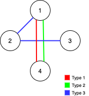

## 1579. 保证图可完全遍历

Alice 和 Bob 共有一个无向图，其中包含 n 个节点和 3  种类型的边：

- 类型 1：只能由 Alice 遍历。
- 类型 2：只能由 Bob 遍历。
- 类型 3：Alice 和 Bob 都可以遍历。
  
给你一个数组 `edges` ，其中 `edges[i] = [typei, ui, vi]` 表示节点 `ui` 和 `vi` 之间存在类型为 `typei` 的双向边。

请你在保证图仍能够被 Alice和 Bob 完全遍历的前提下，找出可以删除的最大边数。如果从任何节点开始，Alice 和 Bob 都可以到达所有其他节点，则认为图是可以完全遍历的。

返回可以删除的最大边数，如果 Alice 和 Bob 无法完全遍历图，则返回 -1 。

示例 1：


输入：n = 4, edges = [[3,1,2],[3,2,3],[1,1,3],[1,2,4],[1,1,2],[2,3,4]]

输出：2

解释：如果删除 [1,1,2] 和 [1,1,3] 这两条边，Alice 和 Bob 仍然可以完全遍历这个图。再删除任何其他的边都无法保证图可以完全遍历。所以可以删除的最大边数是 2 。

示例 2：



输入：n = 4, edges = [[3,1,2],[3,2,3],[1,1,4],[2,1,4]]

输出：0

解释：注意，删除任何一条边都会使 Alice 和 Bob 无法完全遍历这个图。

示例 3：


输入：n = 4, edges = [[3,2,3],[1,1,2],[2,3,4]]
输出：-1
解释：在当前图中，Alice 无法从其他节点到达节点 4 。类似地，Bob 也不能达到节点 1 。因此，图无法完全遍历。

提示：

```c
1 <= n <= 10^5
1 <= edges.length <= min(10^5, 3 * n * (n-1) / 2)
edges[i].length == 3
1 <= edges[i][0] <= 3
1 <= edges[i][1] < edges[i][2] <= n
```

所有元组 `(typei, ui, vi)` 互不相同。

## 解题思路

这道题第一眼想到的就是并查集，先看 type3 的连通支路，union 返回 false 的可以删掉，再看 type1 和 type2 能不能遍历全部节点。

因为是无向无权图，则连通 n 个节点的最少边数一定是 n-1 个，所以只需要保证能连通，即：setCount = 1，那么在有 m 条边的情况下，一定能删掉 m - n + 1 边。

代码：

```js
class UnionFind{
  constructor(n){
    this.parent = new Array(n).fill(0).map((item, index) => index);
    this.size = new Array(n).fill(1);
    this.setCount = n;
  }
  clone(){
    let newUf = new UnionFind(this.size.length);
    newUf.parent = [...this.parent]
    newUf.size = [...this.size]
    newUf.setCount = this.setCount
    return newUf
  }
  findSet(x) {
    if(this.parent[x] === x) {
      return x
    }
    this.parent[x] = this.findSet(this.parent[x])
    return this.parent[x]
  }
  union(x,y) {
    if(this.findSet(x) === this.findSet(y)){
      return false;
    }
    this.size[this.findSet(x)] += this.size[this.findSet(y)]
    this.parent[this.findSet(y)] = this.findSet(x)
    this.setCount--
    return true
  }
  connected(a,b){
    return this.findSet(a) === this.findSet(b)
  }
  count(){
    return this.setCount
  }
  show(){
    console.log(this.parent);
    console.log(this.size);
  }
}
var maxNumEdgesToRemove = function(n, edges) {
  let type1 = []
  let type2 = []
  let type3 = []
  for (let i = 0; i < edges.length; i++) {
    const element = edges[i];
    if(element[0] === 1){
      type1.push(element)
    } else if(element[0] === 2){
      type2.push(element)
    } else if(element[0] === 3){
      type3.push(element)
    }
  }

  let m1 = type1.length + type3.length
  let m2 = type2.length + type3.length
  let l3 = type3.length
  let result = 0
  let uf = new UnionFind(n)
  for (let i = 0; i < type3.length; i++) {
    const element = type3[i];
    let u = uf.union(element[1], element[2])
    if(!u){
      result++
    }
  }
  let min1 = m1 - n + 1 - result
  let min2 = m2 - n + 1 - result

  let total = result + min1 + min2

  let uf1 = uf.clone()
  let uf2 = uf.clone()
  for (let i = 0; i < type1.length; i++) {
    const element = type1[i];
    let u = uf1.union(element[1], element[2])
  }
  for (let i = 0; i < type2.length; i++) {
    const element = type2[i];
    let u = uf2.union(element[1], element[2])
  }
  if(uf1.count() > 1 || uf2.count() > 1){
    return -1
  }

  return total >= 0 ? total : -1
}
```
